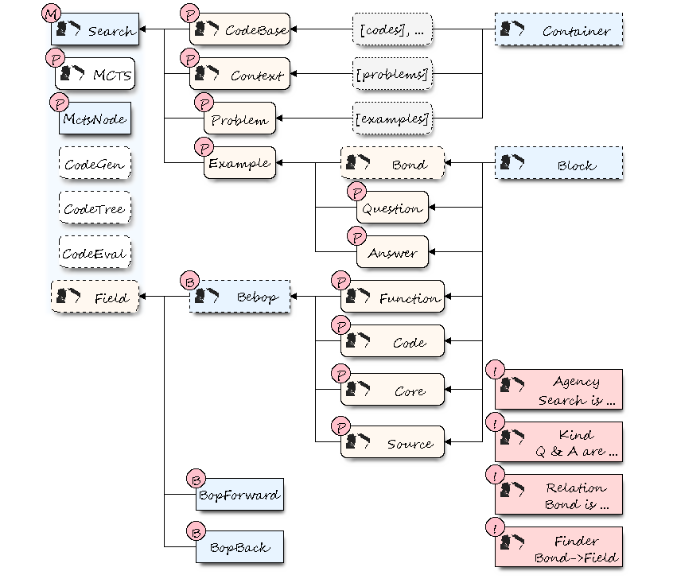

# JazzARC

Proof of Concept Code Generation using Formal Fields applied to the ARC Challenge

## Formal Fields paper and Open Expo slides

We will update this project with links to:

  * Formal Fields Paper
  * Open Expo 2020 presentation [call](https://twitter.com/kaalam_ai/status/1273291838141710336)
  * Open Expo 2020 presentation (slides)
  * Stay tuned!

## License

Note that even if Jazz has an Apache license, this is GPLed. The way to go is [Jazz](https://github.com/kaalam/Jazz), this
is research-only material. Of course, **the content of the data folder belongs to @fchollet**, is under Apache License 2.0 and
can be found [here](https://github.com/fchollet/ARC).

## Class architecture

This is a PoC of the Jazz platform in Python **to research automated code generation**. The classes with a Thelonious icon are Jazz
classes with the same name (simplified for the PoC)

  * Background: cyan (root class), ivory (class with parent), gray (type of Container), pink (related Jazz class not implemented)
  * label: (P) (key property of the class it points to), (B) (Bebop definition), (!) (not implemented), (M) (main)
  * style: dashed (parent of the class it points to), dotted (remark), Thelonious icon (Jazz class)

## Documentation

The code has docstrings in every class and method. This project is a PoC, the main project, with maintained documentation, is
[Jazz](https://github.com/kaalam/Jazz).

## Usage

This is research code. The use is doing experiments and exploring the results. The class `Search` has most utilities, just instance a
`Search` object and do some calls. The script `run_experiment` is an example of this.

## Experimental results

The folder /experiments has results for some experimental runs. This includes a JSON with many details about the search. The class
`Search` has a method `show_found_code()` to parse the json files and extract the code snippets.

### Note on reproducibility ###

When the experiments were run **many snippets now in the code base did not exist**. If you run again, you will find very few new
discoveries since they were discovered in the experiments and the DSL only covers a small portion (150/800??) of the whole set of
problems. Basically, almost all fruits have been reaped. To reproduce the original conditions, you should remove the snippets that
were unknown at the time from the code base. You can do that by parsing the json files and see what was known/unknown at the time.
